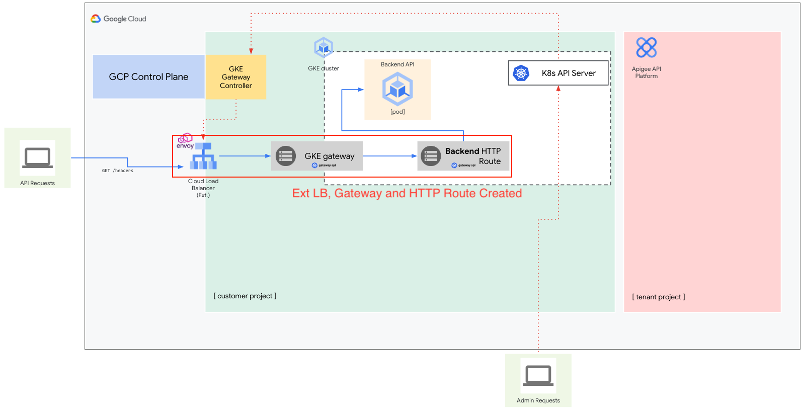
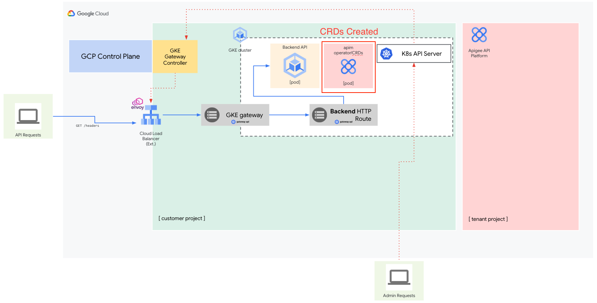
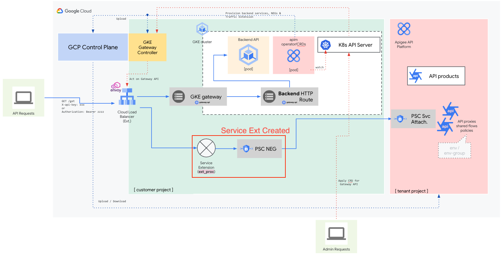
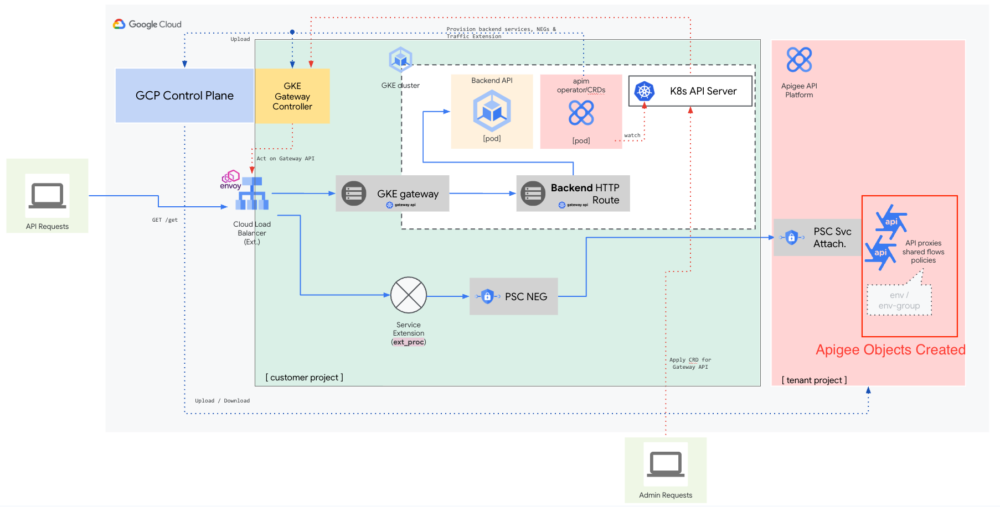

 **Apigee Apim Operator**
 
This sample demonstrates how to use the Apigee APIM Operator to perform API management tasks such as defining API products and operations using a GKE cluster.

The Apigee APIM Operator is designed to support cloud-native developers by providing a command-line interface that integrates with familiar Kubernetes tools like kubectl. The operator works by using various APIM resources to keep your Google Kubernetes Engine cluster synchronized with the Apigee runtime.

The Operator allows you to define and manage API management aspects directly within your Kubernetes cluster using the same YAML files and kubectl commands you already use for your other Kubernetes resources (like deployments, services, etc). The APIM Operator brings Apigee's powerful API management capabilities right into your Kubernetes workflow.

 **Prerequisites**
1. Provision Apigee X
2. Have access and permissions in Google Cloud IAM to create required IAM roles and Google service accounts required 
3. Have access to deploy API Proxies in Apigee,
4. Have access to create Environments and Environment Groups in Apigee
5. Have access to create API Products, Developers, and Developer Apps in Apigee
6. Have access to provision Load Balancer Resources (ip address, forwarding rule, url map, backend service, NEGs, etc)
7. Have access to create Load Balancer Service Extensions
8. Make sure the following tools are available in your terminal's $PATH (Cloud Shell has these preconfigured)
    - gcloud SDK
    - curl
    - jq


 **Configure Environment**

1. Authenticate:
   Ensure your active GCP account is selected in Cloud Shell.

    gcloud auth login


2. Navigate:
   Change to the project directory. 


3. Configure and Source Environment:
   Edit the 1_defaults_apim_operator.sh with your settings.

Then, source it to apply the settings:
```bash
source ./1_defaults_apim_operator.sh
```

**Create GKE Kubernetes Cluster**

In this step, let's create a new GCP Kubernetes Cluster, We will create a number
of kubernetes objects in this cluster as well as the APIM Operator.

The initial architecture will look like this:

1. Run the script:
```bash
    ./2_create_gke_cluster.sh
```
This script creates a zonal gke cluster in the zone and region specififed,
deployment takes about 10 minutes and outputs the gcloud get credentials command
to connect into the kubernetes cluster. 

2. Connect to the cluster with the get credentials command

**Enable Service Account and IAM Roles** 
 Next, lets create the google service account to connect to Google Cloud
 services, grant the required iam roles and permissions to the service account
 to the service account and also create and confirm a workload identity is
 creted.

1. Run the script:
```bash
   ./3_enable_sa_and_roles.sh
```
2. Confirm workload identity is created by running the command below:
```bash
kubectl run --rm -it --image google/cloud-sdk:slim \
  --namespace apim workload-identity-test\
  -- gcloud auth list
```


**Create Gateway, HTTPRoute and Test Application**
 
Next, lets create the Gateway, httproute and a httpbin test application 

1. Run the script:
```bash
    ./4_gateway_app_httproute.sh
```
3. Run a cURL request to access the httpbin test application through the Gateway   
    Note that it may take up to 5 minutes to get a successsful response from the
    command below while the gateway and httproute are being setup
    
```bash
    curl GATEWAY_IP_ADDRESS.nip.io:80/get 
```
4. If using an internal load balancer, create the shell-demo pod and run the
   curl from there with following commands: 
```bash    
    kubectl apply -f shell-demo.yaml 
    kubectl exec shell-demo -c nginx -- curl GATEWAY_IP_ADDRESS.nip.io:80/get
```
The architecture should now look like this




**Install the CRDs and Install the Apigee APIM Operator** 
Next we will install the helm charts for the CRDs and the Apim Operator.
Once completed, we should have an operator pod in running state. 

1. Run the script:
```bash    
    ./5_crds_operator.sh
```
2. run the validation command to see the operator pod: 
```bash
    kubectl get pods -n apim 
```
The architecture should now look like this




**Install the APIM Extension Policy**

Next we will install the APIM extension policy. Once the Extension Policy installed, the service extension gets created and is visible within the Load balancer UI in the GCP console.
1. Run the script:
```bash
    ./6_apimextpolicy.sh
```
The architecture should now look like this 




**Create the Apigee Objects**
Next we will create APIM objects required

1. Run the script:
```bash
    ./7_create_apim_objects.sh
```


**Create the Developer and App in Apigee**
Next we will create the developer and app in Apigee using the script below
1. Run the script:
```bash
    ./8_create-developer-app.sh
```

Now we have created all the resources, the completed architecture will look as below.



**Test API Key Enforcement**
Now we have created an APP in Apigee and have an API Key, we can use the following command to send a request to the Gateway using the API key to test API key enforcement.
```bash
     curl http://GATEWAY_IP_ADDRESS/get -H "Host: HOST_NAME" -H "x-api-key: API_KEY"
```

Where GATEWAY_IP_ADDRESS is the ip address of the Gateway.
HOST_NAME is the hostname defined in the Gateways HTTPRoute/
API_KEY is the API Key value obtained  from running script 8 above. 
You can retrieve the Gateway IP address using te follwoing command

```bash
    kubectl get gateways.gateway.networking.k8s.io GATEWAY_NAME -o=jsonpath="{.status.addresses[0].value}"
```


The request should succeed and return a response similar to the following:

```bash
    {
  "args": {},
  "headers": {
    "Accept": "*/*",
    "Host": "apigee-apim-operator-test.apigee.net",
    "User-Agent": "curl/8.7.1",
    "X-Api-Key": "f0N6sYYYclGYYYe0oP5YYYdA20PjgrP2x8YYYh7z4YYYKiYt",
    "X-Cloud-Trace-Context": "bb3a768787099bda628781188bfb318b/15554891713516675739"
  },
  "origin": "34.54.193.72",
  "url": "https://34.54.193.72/get"
}
```

**Test Quota Enforcement**
To test the quota enforcement defined in your APIM extension policy, send the request from the previous step to the Gateway ten times within the span of one minute.

You can run the following script to generate the requests:

```bash
    #!/bin/sh
for i in $(seq 1 11); do
    curl http://GATEWAY_IP_ADDRESS/get -H "Host: HOST_NAME" -H "x-api-key: API_KEY"
    sleep 1
done
```

This action should trigger a quota violation and raise a fault similar to the following:

```bash
    {"fault":{"faultstring":"Rate limit quota violation. Quota limit  exceeded. Identifier : _default","detail":{"errorcode":"policies.ratelimit.QuotaViolation"}}}
```


**Test REST Operations Enforcement**
To test the rest operations enforcement, use the following command to send a request to the Gateway using a URL that is not in the API operation set:

```bash
    curl http://GATEWAY_IP_ADDRESS/post -H "Host: HOST_NAME" -H "x-api-key: API_KEY"
```
The request should fail with a response similar to the following:

```bash
    {"fault":{"faultstring":"Invalid ApiKey for given resource","detail":{"errorcode":"oauth.v2.InvalidApiKeyForGivenResource"}}}
```


Then, run the following scripts to clean up the resources created earlier.

```bash
    cleanup1-developer-app.sh
```
```bash
    cleanup2-product-operationset.sh
```
```bash
    cleanup3-apimextension.sh
```
```bash
    cleanup4-helm-charts.sh
```
```bash
    cleanup5-gw-httproute.sh
```
```bash
    cleanup6-sa-roles.sh
```
```bash
    cleanup7-cluster.sh
```


